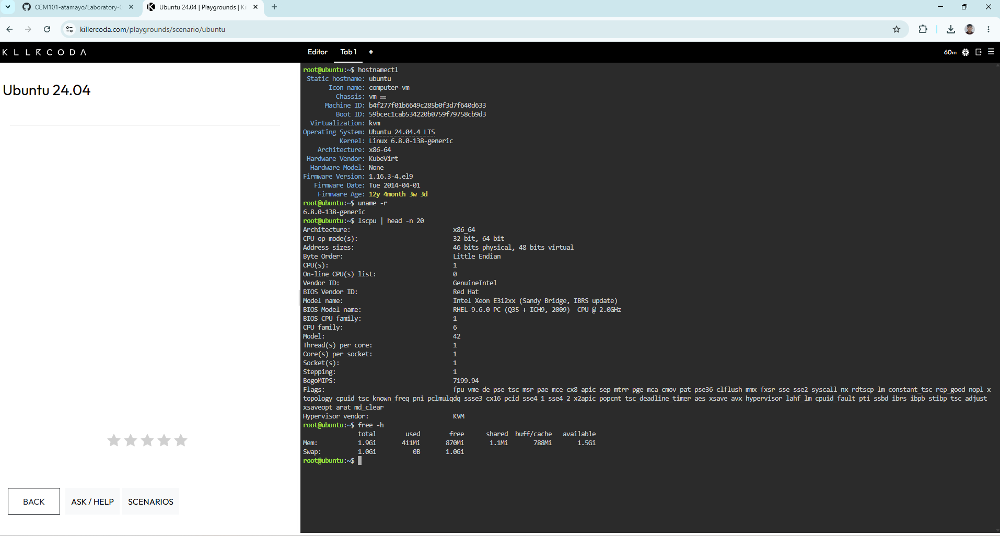
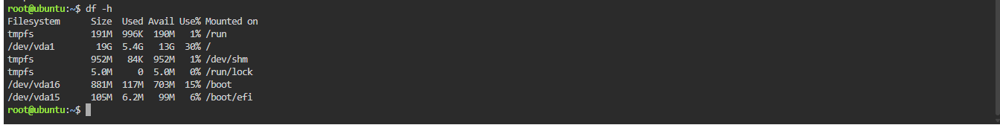
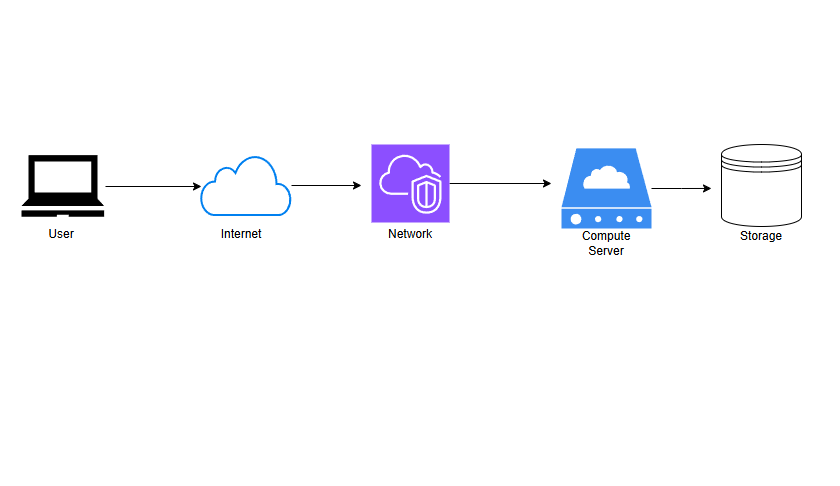

# Laboratory Activity 2: Build the Cloud Infrastructure Blueprint

## Mission Overview
Assessment and investigation of foundational cloud infrastructure components using a Linux cloud environment and multi-cloud architecture mapping.

## Objectives
* Investigate Linux system resources (Compute, Storage, Networking, OS).
* Differentiate major cloud infrastructure components.
* Map and compare core cloud services across AWS, Azure, and GCP.
* Design a baseline cloud infrastructure architecture.

## Cloud Infrastructure Components
* **Compute:** CPU and Memory resource virtualization.
* **Storage:** Block storage and mounted file systems.
* **Networking:** IP routing, virtual network interfaces, and firewalls.
* **Identity Management:** Access control and permissions for cloud assets.

## Tools Used
* KillerCoda Linux Playground (Ubuntu)
* Draw.io / Excalidraw
* GitHub

## Linux Commands Executed
* `hostnamectl` & `uname -r` - Inspected OS version and kernel build.
* `lscpu` - Evaluated CPU architecture and core allocation.
* `free -h` - Analyzed physical and swap memory.
* `df -h` - Checked mounted block storage and disk usage.
* `ip -brief address` - Verified private network configurations.

## Skills Learned
* Extracting hardware and network telemetry using Linux shell commands.
* Translating physical server concepts into cloud services.
* Designing multi-tier cloud infrastructure blueprints.

## Challenges Encountered
* Navigating Linux command-line parameters to isolate specific hardware metrics, resolved by utilizing pipe and regex filtering (`grep`).

## Evidence & Screenshots

### 1. Server Information

### 2. Storage Information

### 3. Network Information

### 4. Cloud Architecture Diagram

