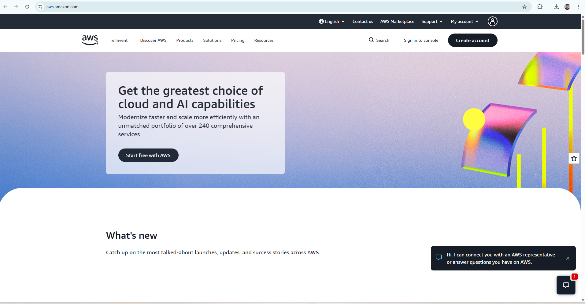

# Amazon Web Services (AWS) Research

## Brief Overview
Amazon Web Services (AWS) is a comprehensive and broadly adopted cloud platform launched by Amazon in 2006. It offers over 200 fully featured services from data centers globally, serving millions of customers—including startups, large enterprises, and leading government agencies—to lower costs, become more agile, and innovate faster.

## Global Infrastructure
AWS operates in multiple geographic regions worldwide. Each AWS Region comprises multiple isolated and physically separate Availability Zones (AZs) connected through low-latency, high-throughput, and highly redundant networking. As of today, AWS spans over 30+ geographic regions and 100+ Availability Zones globally, supported by hundreds of Edge Locations for CloudFront content delivery.

## Cloud Management Console
The AWS Management Console is a web-based portal that allows users to access and manage AWS resources. It provides a user-friendly interface alongside search tools, command-line interfaces (AWS CLI), and SDKs to deploy services, monitor spending, and manage security permissions.

## Four (4) Core Services
1. **Amazon EC2 (Elastic Compute Cloud):** Provides resizable compute capacity (virtual servers) in the cloud.
2. **Amazon S3 (Simple Storage Service):** An object storage service offering industry-leading scalability, data availability, security, and performance.
3. **Amazon VPC (Virtual Private Cloud):** Allows users to provision a logically isolated section of the AWS Cloud where resources can be launched in a virtual network.
4. **AWS IAM (Identity and Access Management):** Enables securely managing access to AWS services and resources.

## Three (3) Advantages
* **Market Pioneer & Breadth:** Offers the widest array of services and feature depth compared to competitors.
* **Scalability & Reliability:** Highly redundant global infrastructure with proven high availability and operational maturity.
* **Vast Ecosystem:** Extremely large community, partner network, third-party integrations, and extensive documentation.

## Typical Enterprise Use Cases
* Host scalable e-commerce platforms and web applications.
* Big Data processing and data lake storage architectures.
* Disaster recovery and multi-region automated backups.
