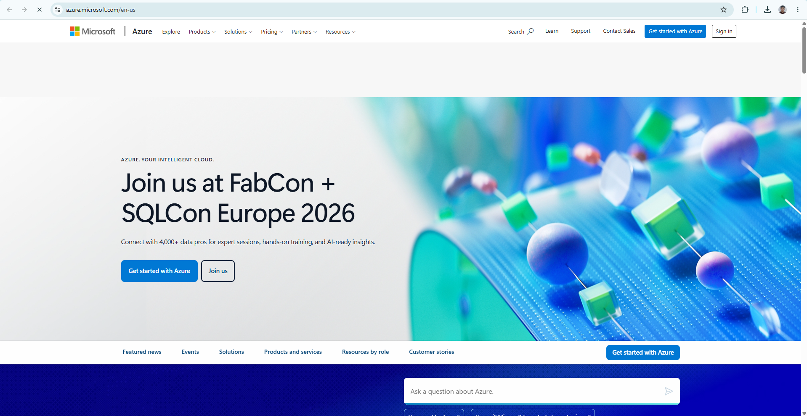

# Microsoft Azure Research

## Brief Overview
Microsoft Azure is a public cloud computing platform launched by Microsoft in 2010. It provides a broad range of cloud services, including compute, analytics, storage, and networking. Azure is particularly well-suited for hybrid cloud environments and integrates seamlessly with existing enterprise Microsoft technologies.

## Global Infrastructure
Azure has a massive global footprint, operating across more than 60 regions worldwide with presence in over 140 countries. Microsoft utilizes Availability Zones within its regions to guarantee high availability and resiliency for critical workloads.

## Cloud Management Console
The Azure Portal is a unified web-based console that allows administrators to build, manage, and monitor everything from simple web apps to complex cloud applications. It features customizable dashboards and integrated Cloud Shell (Bash and PowerShell) access.

## Four (4) Core Services
1. **Azure Virtual Machines (VMs):** On-demand, scalable computing resources for hosting Linux and Windows virtual machines.
2. **Azure Blob Storage:** Massively scalable object storage solution for unstructured data.
3. **Azure Virtual Network (VNet):** Enables Azure resources to securely communicate with each other, the internet, and on-premises networks.
4. **Microsoft Entra ID (formerly Azure Active Directory):** A cloud-based identity and access management service.

## Three (3) Advantages
* **Seamless Microsoft Integration:** Unmatched compatibility with Active Directory, Windows Server, SQL Server, and Microsoft 365.
* **Hybrid Cloud Leadership:** Strong hybrid cloud solutions like Azure Arc and Azure Stack.
* **Enterprise Licensing Discounts:** Cost savings for organizations utilizing existing Microsoft enterprise agreements (Hybrid Benefit).

## Typical Enterprise Use Cases
* Enterprise migration of Windows Server and Active Directory environments.
* Hybrid cloud infrastructure management across enterprise data centers.
* Enterprise SQL database hosting and enterprise ERP deployments.
