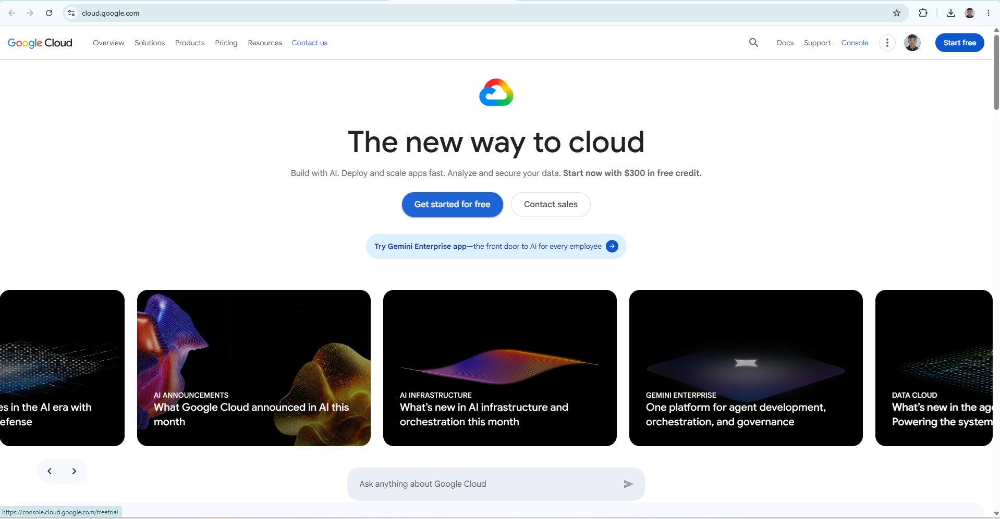

# Google Cloud Platform (GCP) Research

## Brief Overview
Google Cloud Platform (GCP) is a suite of cloud computing services offered by Google, built on the same infrastructure that Google uses internally for its end-user products, such as Google Search and YouTube. Launched publicly in 2008, GCP is renowned for high-performance computing, advanced data analytics, AI/ML, and containerized management.

## Global Infrastructure
Google Cloud’s global network spans over 35+ regions and 100+ Availability Zones connected by Google's private subsea network cables. This high-speed private backbone ensures ultra-low latency and reliable global network performance.

## Cloud Management Console
The Google Cloud Console provides a clean, web-based interface for managing GCP resources. It features an integrated Cloud Shell terminal, granular project management, and fast access to data analytics and AI tools.

## Four (4) Core Services
1. **Google Compute Engine (GCE):** Configurable, high-performance virtual machines running on Google's infrastructure.
2. **Google Cloud Storage (GCS):** Unified, durable, and highly available object storage service.
3. **Google Kubernetes Engine (GKE):** A managed, production-ready environment for running containerized applications (pioneered by Google).
4. **Cloud IAM:** Precise permissions management for Google Cloud resources.

## Three (3) Advantages
* **Industry Leadership in AI & Data Analytics:** Cutting-edge tools like BigQuery, Vertex AI, and TensorFlow optimization.
* **Kubernetes Native:** As the creator of Kubernetes, GCP offers the most mature managed Kubernetes service (GKE).
* **Global Fiber Network:** Outstanding network performance utilizing Google's high-speed private network architecture.

## Typical Enterprise Use Cases
* Large-scale data analytics, machine learning, and AI model training.
* Native microservices deployment and container orchestration.
* Real-time streaming analytics and global web services.
